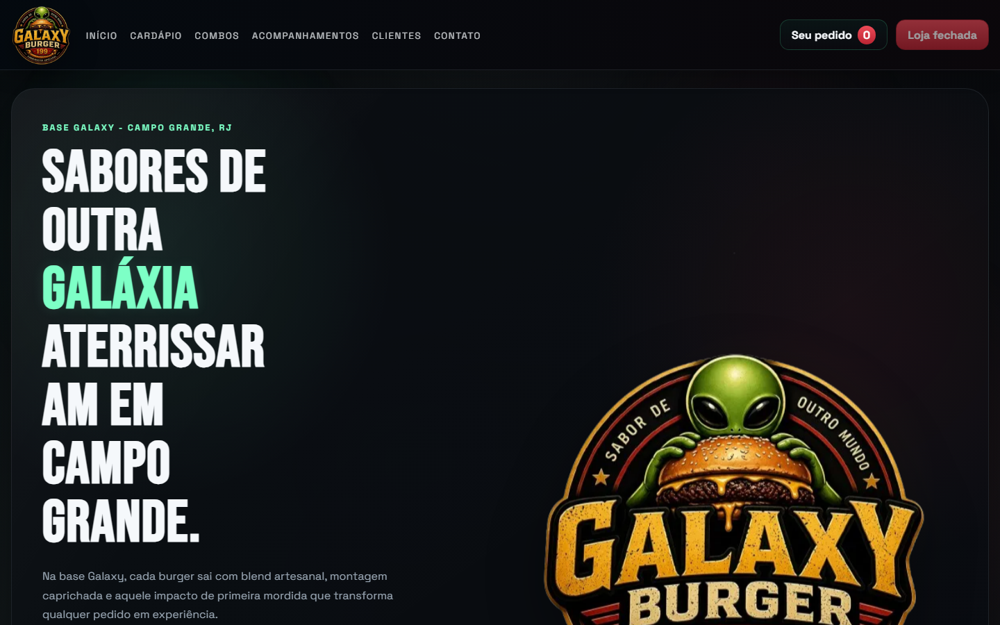

# Galaxy Burger

🔗 **[Ver site ao vivo](https://galaxyburger.vercel.app)**

Sistema web de pedidos para uma hamburgueria real (Campo Grande, RJ): cardápio, checkout com cálculo automático de taxa de entrega por zona, comanda de pedido segura, painel administrativo para controle de estoque/horário de funcionamento, e persistência em produção via Redis — sem depender de nenhuma API paga.

Não é uma landing page estática: tem suíte de testes automatizados (44 testes) rodando em CI a cada push, rate limiting contra pedidos duplicados/abuso, e hardening de sessão no painel admin — decisões de engenharia motivadas por bugs reais encontrados em produção (ex.: variável de ambiente do Redis quebrando silenciosamente por causa de aspas extras).

## Stack

- HTML
- CSS
- JavaScript vanilla
- Deploy: Vercel
- Persistência: Upstash Redis (produção)
- Testes: suíte própria + GitHub Actions CI
- APIs serverless: `api/delivery-quote.js`, `api/order-ticket.js`, `api/admin-login.js`, `api/admin-inventory.js`, `api/admin-store-status.js`, `api/inventory-status.js` e `api/store-status.js`

## Estrutura

- `index.html`: pagina principal
- `style.css`: estilos globais e responsivos
- `carrinho.js`: logica de checkout, horario, WhatsApp e carrinho
- `store-config.js`: dados centrais da loja, Pix, WhatsApp, horarios e links operacionais
- `catalog-config.js`: catalogo central com produtos, precos, combos e disponibilidade
- `delivery-config.js`: cadastro manual das zonas, bairros e ruas atendidas
- `api/delivery-quote.js`: validacao serverless da taxa por zona
- `api/order-ticket.js`: validacao serverless do pedido, estoque, totais e comanda segura
- `admin.html`: painel simples para login e troca de status de estoque
- `admin.js`: interface do painel administrativo
- `api/_store-status-store.js`: persistencia compartilhada do status operacional da loja
- `api/_inventory-store.js`: persistencia compartilhada do estoque
- `img/`: assets visuais do projeto
- `vercel.json`: configuracao de deploy e headers

## Publicacao na Vercel

Este projeto nao precisa de build step.

- Framework preset: `Other`
- Root directory: `.`
- Build command: vazio
- Output directory: `.`

## Variaveis de ambiente

- `DELIVERY_QUOTE_SECRET`: obrigatoria em qualquer ambiente que use a validacao de entrega ou a comanda segura do pedido.
- `ORDER_TICKET_SECRET`: opcional, mas recomendada. Se nao for definida, a API de comanda segura reutiliza `DELIVERY_QUOTE_SECRET`.
- `ADMIN_PANEL_PASSWORD`: obrigatoria para liberar o login do painel administrativo.
- `ADMIN_PANEL_SECRET`: recomendada para assinar a sessao do painel administrativo.
- `UPSTASH_REDIS_REST_URL` / `UPSTASH_REDIS_REST_TOKEN`: necessarias em producao (Vercel) para o painel administrativo salvar de verdade (estoque, areas de entrega, status da loja). Veja a secao "Painel administrativo" abaixo.

## Taxa de entrega

- `Regiao proxima`: `R$ 5,00`
- `Regiao intermediaria`: `R$ 10,00`
- `Fora da cobertura`: apenas retirada no local

As regras ficam centralizadas em `delivery-config.js`, com bairros e ruas cadastrados manualmente. O checkout nao depende de Google Maps nem de qualquer outra API paga.

## Catalogo e pedido seguro

- O cardapio agora usa `catalog-config.js` como fonte unica de preco e disponibilidade.
- A comanda do pedido e preparada por `api/order-ticket.js`, que recalcula subtotal, taxa e total antes de abrir o WhatsApp.
- O link compartilhado da comanda nao expoe dados sensiveis em JSON aberto na URL.

## Painel administrativo

- O acesso administrativo fica em `/admin.html`.
- O painel permite abrir ou fechar os pedidos manualmente sem editar codigo.
- O painel atualiza o status do produto e o cardapio principal reage automaticamente.
- O site principal passa a obedecer esse status operacional em poucos segundos e tambem durante o preparo do pedido.
- Em desenvolvimento local, o estoque fica salvo em `data/inventory-status.json`.
- Em desenvolvimento local, o status operacional fica salvo em `data/store-status.json`.
- Em desenvolvimento local, configure `DELIVERY_QUOTE_SECRET` para testar cotacao e preparo do pedido sem depender de fallback embutido no codigo.
- Em producao na Vercel nao ha volume persistente entre execucoes das funcoes (o disco local nao serve para isso). Por isso o painel usa o [Upstash Redis](https://upstash.com) como armazenamento — plano gratuito para sempre, sem cartao de credito, mais que suficiente para este site.

### Configurar o Upstash Redis (uma vez, necessario para o painel salvar em producao)

1. Crie uma conta gratuita em https://console.upstash.com.
2. Crie um banco Redis (escolha uma regiao proxima da regiao de deploy da Vercel).
3. Na pagina do banco, copie os valores de **REST URL** e **REST TOKEN**.
4. No projeto da Vercel, va em **Settings > Environment Variables** e adicione:
   - `UPSTASH_REDIS_REST_URL`
   - `UPSTASH_REDIS_REST_TOKEN`
5. Faca um redeploy do projeto na Vercel.

Sem essas duas variaveis configuradas, o painel continua funcionando em modo somente leitura em producao (com um aviso visivel no topo da tela), para nunca quebrar ou gerar erro de storage — mas as edicoes so passam a ser salvas de verdade depois desse passo.

## Fluxo profissional recomendado

1. Publicar o projeto em um repositorio GitHub.
2. Importar esse repositorio na Vercel.
3. Conectar a branch `main`.
4. A cada novo push na `main`, a Vercel fara deploy automatico.

## Observacoes

- O arquivo `.gitignore` ja esta preparado para desenvolvimento e deploy.
- O arquivo `vercel.json` aplica headers basicos de seguranca.
- O frontend continua estatico, mas a validacao da entrega depende da funcao serverless `api/delivery-quote.js`.
